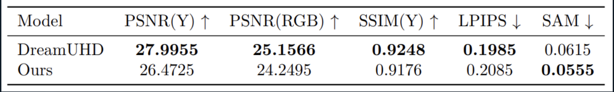
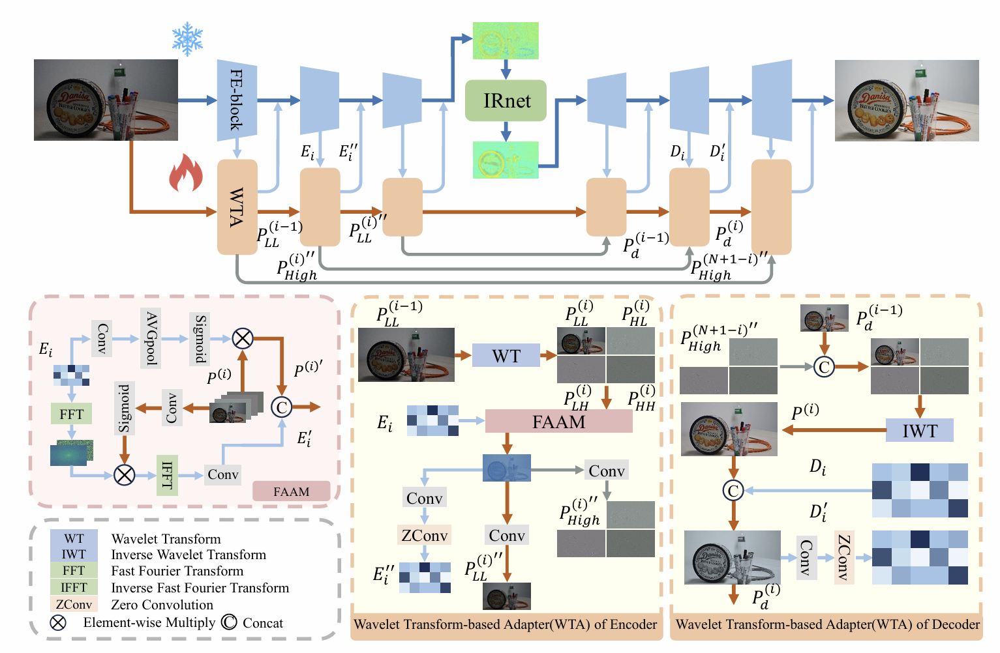

# SleepUHD: FCA-Enhanced Variational Autoencoder for Ultra-High-Definition Image Restoration

> **[Presentation slides with inference examples and comparisons](./presentazione.pdf)**

## Introduction

This repository contains **SleepUHD**, a research project that originates from an in-depth study of the original [DreamUHD](https://ojs.aaai.org/index.php/AAAI/article/view/32640) paper ("DreamUHD: Frequency Enhanced Variational Autoencoder for Ultra-High-Definition Image Restoration", AAAI 2025).

By carefully analysing the FE-VAE encoder architecture we identified a critical issue in the **SFAD (Spectral Feature Aggregation and Distribution)** block. Inside the encoder, SFAD performs a channel-wise low-pass filtering operation: it aggregates spectral features across channels and redistributes a smoothed version of them. While this improves global consistency, it has an unwanted side-effect — it **softens the inter-channel variations**, radically altering the individual contribution of each channel and ultimately **compromising the colour variations** that each channel was specifically capturing.

To address this, we replaced the SFAD block with an **FCA (Frequency Channel Attention)** block, as proposed in:

> Qilong Wang, Banggu Wu, Pengfei Zhu, Peihua Li, Wangmeng Zuo, and Qinghua Hu.  
> *"FcaNet: Frequency Channel Attention Networks."*  
> IEEE/CVF International Conference on Computer Vision (ICCV), 2021.

The FCA block leverages Discrete Cosine Transform (DCT)-based multi-spectral channel attention, allowing each channel to retain its distinctive frequency information while still performing meaningful channel recalibration — without the destructive averaging that SFAD introduced.

### Encoder Architecture

The figure below zooms into the FE-VAE encoder, highlighting the position of the original SFAD block:

### SFAD → FCA Replacement

The following diagram illustrates how the SFAD block was replaced by the FCA block inside the encoder:

### Visual Comparison: SFAD vs FCA

A side-by-side visual comparison of the outputs produced by the two variants is shown below:

### Quantitative Results

> **Note:** The results presented above were obtained **exclusively on the low-light enhancement task**. Furthermore, due to GPU memory constraints, all experiments were run with a **3K crop** rather than full-resolution UHD images. Results on other tasks and at full resolution may differ.

---

## Key Features (inherited from DreamUHD)
- VAE-Based UHD Image Restoration: To the best of our knowledge, this is the first work to introduce VAEs into the domain of UHD image restoration. By operating in the compact latent space of a VAE, our framework enhances restoration consistency and significantly reduces computational overhead.
- Frequency-Enhanced VAE (FE-VAE): We propose a novel Fourier-based, frequency-enhanced VAE that is both lightweight and powerful. By incorporating the global perceptual capabilities of the Fourier domain, FE-VAE achieves a substantial reduction in parameter count and computational cost without compromising its representational power.
- Wavelet Transform-based Adapter (WTA): A wavelet-based adapter is introduced to supplement the high-frequency details essential for high-fidelity image restoration. This module effectively bridges the domain gap between the pre-trained VAE and degraded images by combining spatial and frequency information.
- **FCA Block (SleepUHD contribution):** Replaces the SFAD block in the FE-VAE encoder with a DCT-based frequency channel attention module that preserves per-channel colour fidelity.

## Framework Overview
The SleepUHD framework builds on DreamUHD's three main components:
- A frozen, pre-trained FE-VAE (with SFAD replaced by FCA): This serves as the backbone of our model, providing an efficient and compact latent space for image representation. 
- A Wavelet Transform-based Adapter (WTA): This module works in tandem with the FE-VAE to inject high-frequency information and mitigate the domain gap.
- An arbitrary restoration network (IRNet): This is a lightweight network that performs the actual restoration task within the latent space. 

